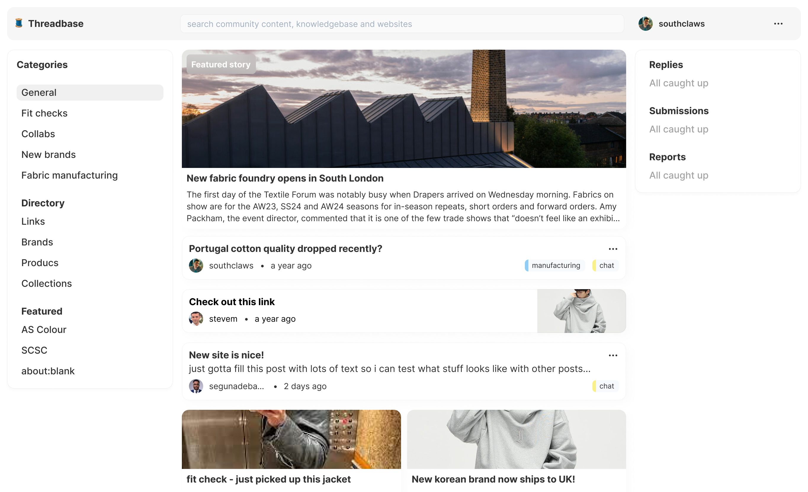

  <!-- <a aria-label="storyden logo" href="https://storyden.org"> -->
    
  <!-- </a> -->

  <em>a modern community platform</em>

  <a
    href="https://storyden.org/docs"
  >Documentation</a>
  |
  <a
    href="https://makeroom.club"
  >Friends</a>

  With a fresh new take on traditional bulletin board web forum software,
  Storyden is a modern, secure and extensible platform for building communities.

# Storyden source

Storyden is structured as a monorepo everything tracked together.

This project is a work in progress and mostly usable for non-critical applications (don't build your business entirely on Storyden in its current state, but spin up an instance and invite your members!)

If you'd like to help with some research, please fill in this tiny (anonymous) form: https://airtable.com/shrLY0jDp9CuXPB2X

## What

Storyden is a discussion forum, a Notion workspace and your own Reddit platform all rolled into one. Your community can use it for discussion, sharing links or building a directory of knowledge or structured data.

It's open source, always has been and always will be.

Here's a screenshot, which may not be representative of the current version but it's a decent example of the general vibes of the app:

## Why

More on that here: https://www.storyden.org/blog/building-running-administrating-modern-forum-software

The short version is: most forums are decades old, insecure, abandoned or just not pretty. Storyden aims to solve all of that with a modern language, simple deployment and beautiful design.

## How

For a general high-level overview, this [article covers](https://www.storyden.org/blog/the-architecture-of-modern-forum-software) some of the tools chosen and rationale.

Storyden's backend is written in Go and its frontend is written in TypeScript with Next.js as the framework of choice.

### Code generation

We make use of code generation wherever possible:

- the OpenAPI spec generates all the boring bits for HTTP handlers and client
- an Ent schema generates all the database bindings and migrations

To run code generation for the backend and frontend, run `task generate`.

## Contributing

Contributions are very very welcome! ❤️ Until we get a proper guide set up, please open an issue if you have any questions!
