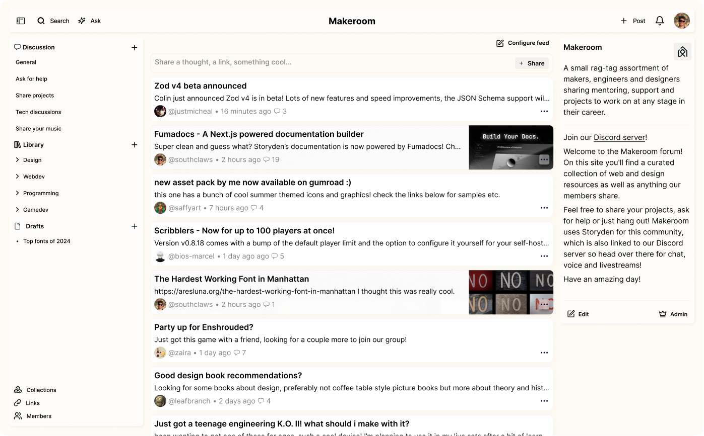

<p align="center">
  <a aria-label="storyden logo" href="https://storyden.org">
    
  </a>
</p>

<p align="center">
  <em>a modern community platform</em>
  <br />
  <em>现代社区平台</em>
</p>

<p align="center">
  <a
    href="https://storyden.org/docs"
  >Documentation</a>
  |
  <a
    href="https://makeroom.club"
  >Friends</a>
</p>

<p align="center">
  With a fresh new take on traditional bulletin board web forum software,
  Storyden is a modern, secure and extensible platform for building communities.
  <br />
  Storyden 以全新的方式重塑传统论坛软件，是一个现代、安全、可扩展的社区构建平台。
</p>

# Storyden

## 中文简介

Storyden 是一个用于管理社区与内容的平台。你可以用它运行论坛、博客、新闻发布、链接收藏、目录、知识库等社区空间。

快速体验：

```sh
docker run -p 8000:8000 ghcr.io/southclaws/storyden
```

然后打开 `http://localhost:8000`。

本地开发请查看 [LOCAL_DEVELOPMENT.md](./LOCAL_DEVELOPMENT.md)。

Storyden is the platform for managing community and content, wherever they call home. Run a forum, a blog, post news, curate cool sites, build a directory, a knowledgebase and more. [Learn more here](https://www.storyden.org/docs/introduction/what-is-storyden).

If you'd like to help with some research, please fill in this tiny (anonymous) form: https://airtable.com/shrLY0jDp9CuXPB2X

You can try it right now! Run the image and open http://localhost:8000 in your browser:

```sh
docker run -p 8000:8000 ghcr.io/southclaws/storyden
```



## Releases and versions

## 发布与版本

Storyden 使用简单的版本号发布带标签的版本；这个版本号适用于整个产品，而不是某个 API 表面。因此，我们不使用“语义化版本”。Storyden 会尽量避免破坏性 API 变更；如果确实发生，变更会在 release notes 中明确说明，也会单独列出破坏性变更清单。

Storyden releases tagged versions using a simple version number which applies to the product _as a whole_ not the API surface. For this reason, we do not use "semantic versioning" and breaking API changes are avoided as much as possible. Sometimes breaking changes may occur but these will always be documented and called out in release notes as well as in a separate list of just breaking changes.

```
  v1.25.8
   │ │  │
   │ │  └── Release: increments for every release in the year.
   │ └───── Year: releases happen frequently so we use a year marker for simplicity
   └─────── Major: will always be 1
```

这个格式是为了兼容包/应用注册表和开发者预期，但它并不遵循语义化版本，更像电子游戏常用的“构建号”。

在 release commit/image 之外，文件和 API 中的版本号会带上 `-post` 后缀，表示当前代码不在稳定发布版本上。

This format was chosen for compatibility with package/app registries and developer expectations, but it does not follow semantic versioning, it's more of a "build number" similar to how video games are versioned.

Outside of a release commit/image, version numbers inside files and the API will be suffixed with `-post` to indicate you're off a stable release.

## What can it do

## 它能做什么

> https://www.storyden.org/docs/introduction/what-is-storyden

Storyden 是一个现代论坛、wiki 和社区枢纽。它像过去的互联网论坛，但有一层新的外观，也带有现代安全、部署和智能功能。你可以把它看成讨论论坛、Notion 工作区和自己的 Reddit 平台的结合体。你的社区可以用它讨论、分享链接，或者构建知识与结构化数据目录。

Storyden 是开源的，[非常容易自托管](https://www.storyden.org/docs/introduction/vps)，也是对 2000 年代互联网的一次致敬。

Storyden is a modern forum, wiki and community hub. Like the internet forums of the past, but with a fresh coat of paint and modern security, deployment and intelligence features. A discussion forum, a Notion workspace and your own Reddit platform all rolled into one. Your community can use it for discussion, sharing links or building a directory of knowledge or structured data.

It's open source, [super easy to self host](https://www.storyden.org/docs/introduction/vps) and an homage to the 2000s internet!

## Why

## 为什么

> https://www.storyden.org/blog/building-running-administrating-modern-forum-software

简短地说：大多数论坛已经有几十年历史，要么不安全，要么被遗弃，要么就是不够好看。Storyden 希望用现代语言、简单部署和漂亮设计解决这些问题。

The short version is: most forums are decades old, insecure, abandoned or just not pretty. Storyden aims to solve all of that with a modern language, simple deployment and beautiful design.

## Contributing

## 参与贡献

本地开发请查看 [LOCAL_DEVELOPMENT.md](./LOCAL_DEVELOPMENT.md)。

非常欢迎贡献！❤️ 在正式贡献指南准备好之前，如果你有任何问题，请先打开一个 issue。

See [LOCAL_DEVELOPMENT.md](./LOCAL_DEVELOPMENT.md) for local development documenation.

Contributions are very very welcome! ❤️ Until we get a proper guide set up, please open an issue if you have any questions!
