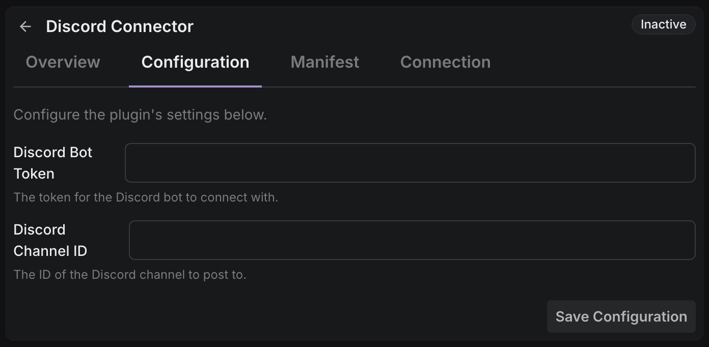

This page is intentionally concrete. No roadmap guessing, just current behaviour.

## What plugins can do

### Subscribe to platform events

Plugins can subscribe to supported Storyden events and react in real time.

This covers common automation/integration tasks such as notifications, indexing, downstream sync, and moderation-side workflows.
See [Manifest -> `events_consumed`](/docs/extending/manifest#events_consumed) and [RPC -> `event`](/docs/extending/rpc/host-to-plugin/event).

### Receive and apply runtime configuration

Plugins can define a simple config schema in their manifest which is used to build a configuration UI in the Admin UI. When a user changes configuration, Storyden validates the new config against the schema and sends it to the plugin via RPC.
See [Manifest -> `configuration_schema`](/docs/extending/manifest#configuration_schema), [RPC -> `configure`](/docs/extending/rpc/host-to-plugin/configure), and [RPC -> `get_config`](/docs/extending/rpc/plugin-to-host/get_config).

Current schema field types are intentionally small:

- string
- number
- boolean

### Call host RPC methods

Plugins can call host-side RPC methods for operations like:

- retrieving plugin configuration
- requesting API access credentials (when access is declared)

See [RPC Reference](/docs/extending/rpc), especially [Plugin to Host](/docs/extending/rpc/plugin-to-host).

### Use the HTTP API (when access is requested)

If the manifest includes `access`, Storyden can provision an account identity and access key for the plugin. That key is then used for normal API calls under explicit permissions.
See [Manifest -> `access`](/docs/extending/manifest#access) and [Security -> API access identity model](/docs/extending/security#api-access-identity-model).

This keeps plugin API actions inside the same permission model as the rest of Storyden.

The account provisioned for a plugin will be "invited by" the member who installed the plugin. You can at any time tweak this account's permissions, roles, revoke its keys or just ban it if the plugin is misbehaving.

When a plugin is uninstalled, its account will remain in case it's linked to any content. You can however just purge its content just like any other account if you don't want it any more.

## What plugins cannot do

### Modify requests/responses

Plugins cannot hook into API request data or responses.

### Affect the Storyden UI

Plugins cannot modify the Storyden UI. Users may be using a custom frontend so this is unlikely to be universally possible. We do however plan to allow plugins to provide `<script>` tags for injection into the UI.

### Access the database

Not directly through plugin APIs. Runtime placement still matters:

- [Local supervised runtime](/docs/extending/supervised-runtimes/local): technically possible if the host environment exposes it, but strongly discouraged, _especially_ if you're distributing a plugin for other people to use.
- [Sprites supervised runtime](/docs/extending/supervised-runtimes/sprites): not in the same local host environment as Storyden.
- External: entirely depends on where you run the plugin.

### No implicit/wildcard event subscription

If an event is not listed in `events_consumed`, it is not delivered.

### No arbitrary runtime mutation of manifest shape

Manifest is the contract. Runtime configuration is separate and does not replace manifest-defined behaviour.

### No bypass of permission model

Plugins do not get silent elevated API powers. If a plugin needs API access, it must request explicit permissions via manifest `access.permissions` and operate through a provisioned key.
