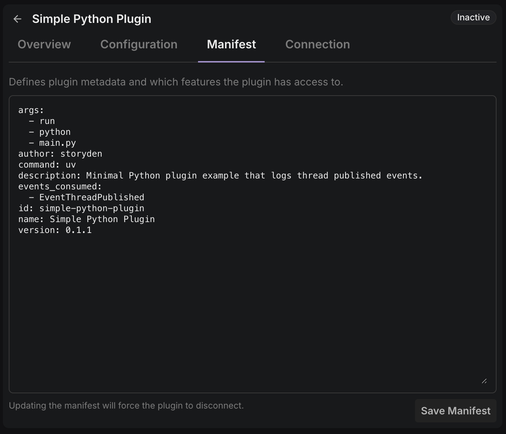

Plugins in Storyden are installed resources with a manifest contract, a runtime mode, and an authenticated RPC session.

## Manifest is source of truth

A plugin [manifest](/docs/extending/manifest) defines:

- Identity (`id`, `name`, `author`, `version`)
- Event subscriptions (`events_consumed`)
- Optional API identity requirements (`access`)
- Optional configuration contract (`configuration_schema`)
- If the plugin is supervised:
  - Runtime entrypoint (`command`, and optional `args`)

Storyden uses this as the primary contract for install and runtime behaviour for both supervised and external plugins.
See [Manifest -> top-level fields](/docs/extending/manifest#top-level-fields) for the generated schema reference.

## Two plugin modes

### Supervised

Supervised plugins are packaged and run by Storyden itself.

- Installed from an archive (`.sdx` / `.zip` payload)
- Process lifecycle managed by Storyden itself, supervised plugins cannot reconnect on their own
- Storyden can enable and disable
- Logs are collected and viewable in the Plugins section of Settings

### External

External plugins run outside Storyden and connect in over authenticated WebSocket RPC.

- Installed/updated via pasting a manifest YAML/JSON
- No process management by Storyden
- No host-managed log stream
- Connection authenticated with an external RPC token
- Token lifecycle and security model are documented in [Security -> RPC authentication model](/docs/extending/security#rpc-authentication-model)

<Callout type="info">
  External mode is the easiest way to iterate during plugin development because
  the plugin process and debugger are fully under your control.
</Callout>

## Session lifecycle

At runtime, plugins attach as sessions.

High-level flow:

1. Plugin installed
2. (If supervised) Plugin is activated and its process is started
3. Plugin connects and authenticates over RPC
4. Host marks session as connected/active
5. RPC requests and events flow in both directions
6. Disconnect, unload, token cycle, or state change tears session down

For protocol-level details, see [API Overview -> How the two layers fit](/docs/extending/api-overview#how-the-two-layers-fit) and [RPC Reference](/docs/extending/rpc).

## Event delivery model

Event subscriptions are explicit.

A plugin receives only what it declares in `events_consumed`, and event delivery is done via typed host-to-plugin RPC methods.
See [Manifest -> `events_consumed`](/docs/extending/manifest#events_consumed) and [RPC -> Host to Plugin -> `event`](/docs/extending/rpc/host-to-plugin/event).

## Configuration model

Plugin configuration has two layers:

- `configuration_schema` in the manifest (shape contract for UI + validation)
- Stored config values (runtime data)

When config changes, Storyden validates and sends `configure` RPC to the plugin.

Plugins can also call `get_config` RPC when needed.
See [Manifest -> `configuration_schema`](/docs/extending/manifest#configuration_schema), [RPC -> `configure`](/docs/extending/rpc/host-to-plugin/configure), and [RPC -> `get_config`](/docs/extending/rpc/plugin-to-host/get_config).
