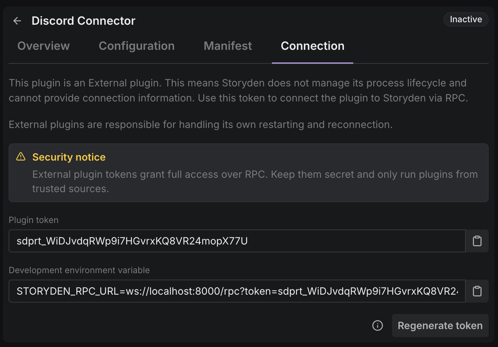

import { Tab, Tabs } from "fumadocs-ui/components/tabs";

Storyden plugins run with explicit boundaries by design. This page covers the important ones.

## RPC authentication model

Plugin RPC sessions authenticate with a token in the RPC URL. Supervised plugins receive this URL via environment variable, external plugins can fetch and store it however they want. It looks like this:

<Tabs items={["Local", "Sprites"]}>
<Tab value="Local">

```
STORYDEN_RPC_URL=ws://localhost:8000/rpc?plugin_id=abc&token=abc123
```

</Tab>

<Tab value="Sprites">
```
STORYDEN_RPC_URL=wss://your-domain.example/rpc?plugin_id=abc&token=abc123
```
</Tab>
</Tabs>

The URL is built from your API address. `http` becomes `ws`, and `https` becomes `wss`.

Only one RPC session can exist per plugin. The token is a secret that grants authenticated access to the Storyden RPC API, so it must be protected like any other credential. The token handling and semantics differ between Supervised and External plugins:

### Supervised

- Supervised plugin tokens are use-once.
- This is why Supervised plugins cannot restart themselves.
- Storyden issues a new token via environment variable when it boots the process.
- When the process connects, the token is validated then immediately discarded.
- The RPC URL contains the plugin's installation ID.

### External

- Token handling differs from the use-once semantics of Supervised plugins.
- External plugin tokens are static bearer tokens with no expiration.
- When the process connects, the token is used to identify the plugin.
- The RPC URL does not contain the plugin's installation ID.

If the connection token is regenerated, the plugin using it will be disconnected and will need to be restarted with the new token.

You can get the token and an environment variable copy-paste helper from the Connection tab of the plugin:



## API access identity model

Plugin API access is opt-in via manifest `access`.

See [Manifest -> `access`](/docs/extending/manifest#access).

When granted, Storyden provisions an account identity with the requested permissions and an access key for API usage.

Key points:

- Access is explicit, not implicit.
- Permissions are declared, inspectable, and enforceable.
- You can revoke the key at any time, ban the account, or uninstall the plugin.
- Uninstalling a plugin revokes all keys automatically.
- The account will not be deleted however.

## Runtime boundaries

### Supervised

Supervised plugins run as host-managed child processes with lifecycle controls and host-side logging surfaces.

The security boundary depends on which supervised runtime provider you're using:

- [Local runtime](/docs/extending/supervised-runtimes/local): plugin process runs on the same machine as Storyden with the same host-level network/filesystem visibility as that machine.
- [Sprites runtime](/docs/extending/supervised-runtimes/sprites): plugin process runs in a remote isolated runtime managed by [Fly.io](https://fly.io).

In both cases, plugins still do not get implicit API permissions. API access remains explicit through manifest `access`.

Do not install third-party plugins without vetting source code.

### External

External plugins are managed by you on your infrastructure. This still comes with risks. The same diligence applies for plugins from third parties.

RPC tokens are sensitive secrets that grant authenticated access to your Storyden instance.

## Token handling guidance

- Treat RPC tokens and API access keys as secrets.
- Store them in environment variables or secret managers.
- Do not commit them to source control.
- Rotate credentials when compromised or no longer needed.

## Operational hardening

- Keep plugin permissions minimal.
- Prefer narrow, purpose-built plugin accounts.
- Monitor plugin-originated API activity like any other automated actor.
- Revoke or cycle credentials as part of incident response.

## Security posture summary

Security is based on explicit manifests, explicit permissions, authenticated transport, and normal API authorization semantics.
