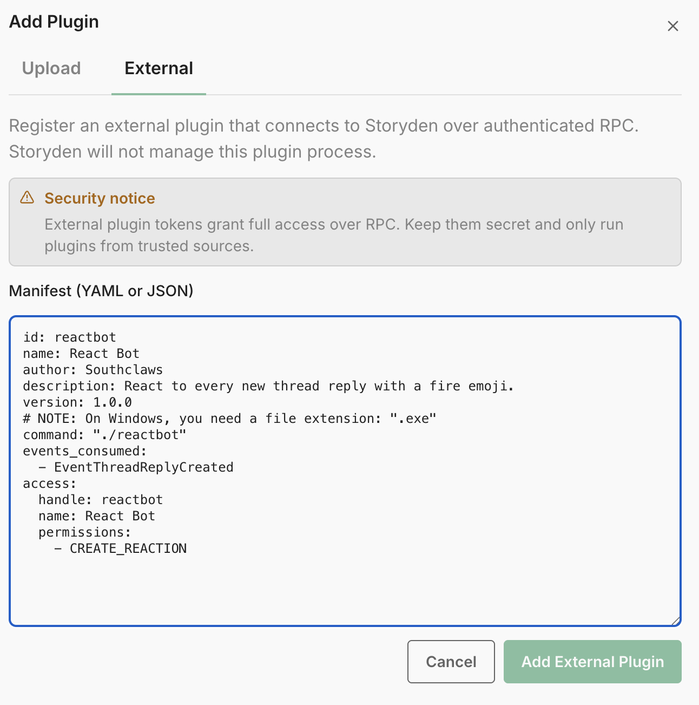
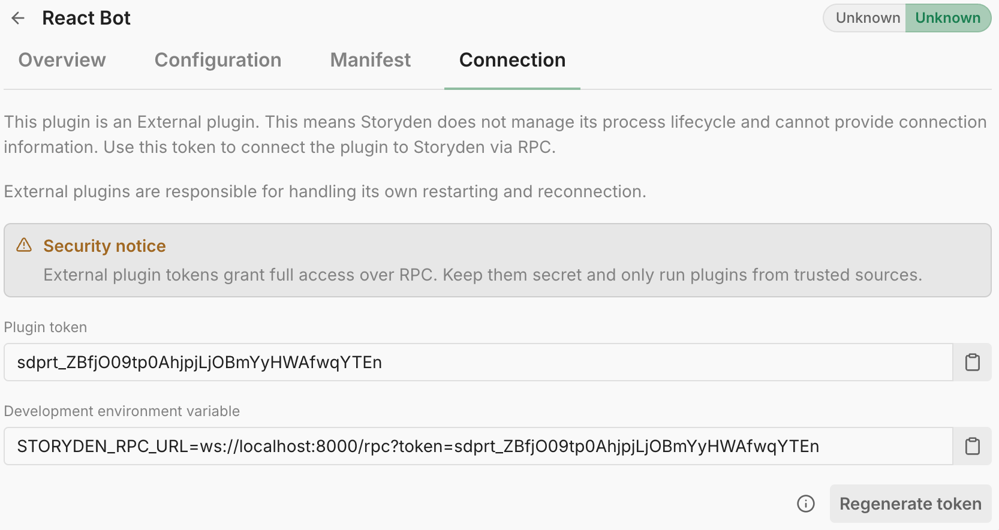
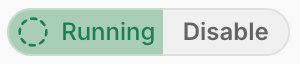
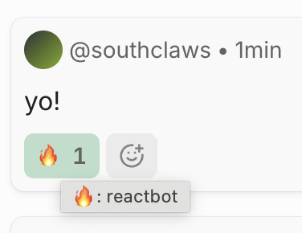
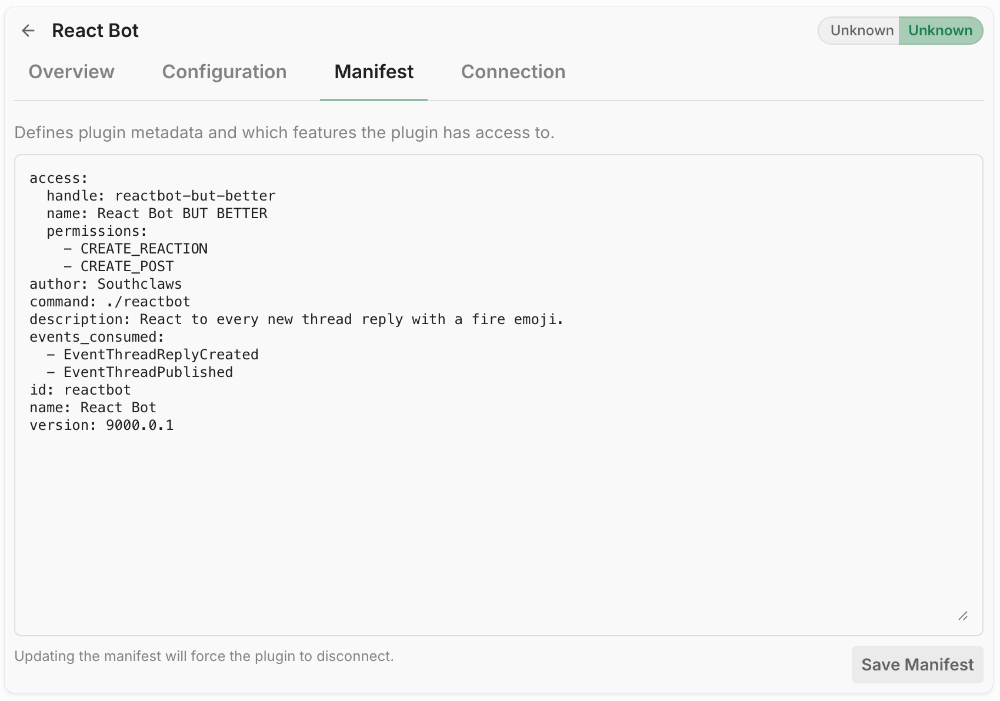
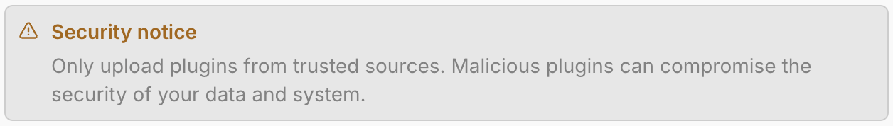

import { Tab, Tabs } from "fumadocs-ui/components/tabs";

This tutorial builds a very serious enterprise integration called `reactbot`.

It does one thing:

- listens for `EventThreadReplyCreated`
- reacts to each new reply with a fire emoji (`\U0001F525`)

No dashboard. No AI. No blockchain. Just a useful bot with commitment issues.

## What you will build

By the end you will have:

- a working Go plugin in `main.go`
- a manifest in `manifest.yaml`
- a local development workflow (External mode)
- a package flow for Supervised installs (`manifest.json` + binary in `.zip`)

If you have not read the architecture docs yet, do that first:

- [Plugin Model](/docs/extending/model)
- [Manifest](/docs/extending/manifest)
- [Security](/docs/extending/security)

## 1. Create the plugin manifest

Create `manifest.yaml`:

<Tabs groupId="user-environment" items={["You are using Windows", "You are using Mac", "You are using Linux"]}>
<Tab value="You are using Windows">

```yaml
id: reactbot
name: React Bot
author: Southclaws
description: React to every new thread reply with a fire emoji.
version: 1.0.0
command: "./reactbot.exe"
events_consumed:
  - EventThreadReplyCreated
access:
  handle: reactbot
  name: React Bot
  permissions:
    - CREATE_REACTION
```

</Tab>
<Tab value="You are using Mac">

```yaml
id: reactbot
name: React Bot
author: Southclaws
description: React to every new thread reply with a fire emoji.
version: 1.0.0
command: "./reactbot"
events_consumed:
  - EventThreadReplyCreated
access:
  handle: reactbot
  name: React Bot
  permissions:
    - CREATE_REACTION
```

</Tab>
<Tab value="You are using Linux">

```yaml
id: reactbot
name: React Bot
author: Southclaws
description: React to every new thread reply with a fire emoji.
version: 1.0.0
command: "./reactbot"
events_consumed:
  - EventThreadReplyCreated
access:
  handle: reactbot
  name: React Bot
  permissions:
    - CREATE_REACTION
```

</Tab>
</Tabs>

What matters here:

- `events_consumed` subscribes the plugin to reply creation events
- `access.permissions` asks for `CREATE_REACTION` so API calls can add reacts (see [Permissions](/docs/introduction/members/permissions))
- `command` is the supervised runtime entrypoint (`./reactbot.exe` on Windows, `./reactbot` on Mac/Linux)

## 2. Implement the plugin with the Go SDK

Walk through the key components to a plugin, then check out the full code at the end.

<Tabs items={["Bit by bit", "Full code"]}>
<Tab value="Bit by bit">

### Setup

This prepares the plugin to connect to the Storyden instance based on the `STORYDEN_RPC_URL` environment variable. If anything isn't set up right, this will return an error.

```go
plugin, err := storyden.New(ctx)
```

The context you pass in here should be the main context for your plugin, which is canceled when the plugin is stopped. This ensures that any long-running operations are properly cleaned up on shutdown.

### Events

You register events after creating the plugin instance, but before calling `Run`. This ensures you don't miss any events that come in as soon as the plugin starts.

```go
plugin.OnThreadReplyCreated(func(ctx context.Context, event *rpc.EventThreadReplyCreated) error {
	// event handling logic here
})
```

### Start the Plugin

And that's it! All you need to do now is call `Run`! This will block until the plugin is stopped, either by an interrupt signal or by an error. If it returns an error, the plugin failed to start or encountered a runtime error.

```go
plugin.Run(ctx)
```

### API client

Once you're connected, you can build an authenticated API client to make calls back to the host. This is where you get access to the permissions you declared in the manifest.

<Callout type="warn">
  You must call `Run` before calling `BuildAPIClient`. This is because the RPC
  connection to the host is not established until `Run` is called. If you try to
  build an API client before `Run`, it will fail because there is no connection
  to the host yet.
</Callout>

```go
client, err := plugin.BuildAPIClient(timeoutCtx)
```

For example, you can add a reaction to a post:

```go
client.PostReactAddWithResponse(ctx, postID, openapi.PostReactAddJSONRequestBody{
	Emoji: fireEmoji,
})
```

Now check out the **Full code** tab for the complete implementation with API calls and logging.

</Tab>

<Tab value="Full code">

```go
package main

import (
	"context"
	"errors"
	"fmt"
	"log/slog"
	"os"
	"os/signal"
	"time"

	"github.com/Southclaws/storyden/app/transports/http/openapi"
	"github.com/Southclaws/storyden/lib/plugin/rpc"
	"github.com/Southclaws/storyden/sdk/go/storyden"
)

const (
	fireEmoji      = "\U0001F525"
	apiCallTimeout = 10 * time.Second
)

func main() {
	logger := slog.New(slog.NewTextHandler(os.Stdout, &slog.HandlerOptions{Level: slog.LevelInfo}))
	slog.SetDefault(logger)

	ctx, stop := signal.NotifyContext(context.Background(), os.Interrupt)
	defer stop()

	plugin, err := storyden.New(ctx)
	if err != nil {
		logger.Error("failed to create plugin", slog.String("error", err.Error()))
		os.Exit(1)
	}
	defer func() {
		if err := plugin.Shutdown(); err != nil && !errors.Is(err, context.Canceled) {
			logger.Warn("plugin shutdown returned error", slog.String("error", err.Error()))
		}
	}()

	bot := &reactBot{
		plugin: plugin,
		logger: logger,
	}

	// Declare event subscription handlers before starting the plugin runtime.
	plugin.OnThreadReplyCreated(bot.onThreadReplyCreated)

	// Run opens the RPC connection to Storyden and starts receiving events.
	if err := plugin.Run(ctx); err != nil {
		if errors.Is(err, context.Canceled) {
			return
		}
		logger.Error("plugin stopped", slog.String("error", err.Error()))
		os.Exit(1)
	}
}

type reactBot struct {
	plugin *storyden.Plugin
	logger *slog.Logger
}

func (r *reactBot) onThreadReplyCreated(ctx context.Context, event *rpc.EventThreadReplyCreated) error {
	timeoutCtx, cancel := context.WithTimeout(ctx, apiCallTimeout)
	defer cancel()

	// Build an authenticated API client using the plugin access declared in manifest.yaml.
	client, err := r.plugin.BuildAPIClient(timeoutCtx)
	if err != nil {
		return fmt.Errorf("build api client: %w", err)
	}

	// ReplyID is the post ID for the newly created reply, so we react to that post directly.
	postID := openapi.PostIDParam(event.ReplyID.String())
	resp, err := client.PostReactAddWithResponse(timeoutCtx, postID, openapi.PostReactAddJSONRequestBody{
		Emoji: fireEmoji,
	})
	if err != nil {
		return fmt.Errorf("create reaction: %w", err)
	}

	if resp.StatusCode() != 200 {
		return fmt.Errorf("create reaction returned status %d", resp.StatusCode())
	}

	r.logger.Info(
		"reacted to new reply",
		slog.String("reply_id", event.ReplyID.String()),
		slog.String("thread_id", event.ThreadID.String()),
		slog.String("emoji", fireEmoji),
	)

	return nil
}
```

</Tab>
</Tabs>

What this demonstrates:

- event handler registration via `OnThreadReplyCreated`
- plugin-to-host access bootstrap via `BuildAPIClient`
- normal authenticated API usage via `PostReactAddWithResponse`

## 3. Run it as an External plugin (fast dev loop)

This is the easiest way to iterate.

1. In Storyden, go to Admin -> Plugins tab.
2. Add a new plugin in **External** mode.
3. Paste the manifest contents from `manifest.yaml`.



4. Open the plugin Connection tab and copy the `STORYDEN_RPC_URL=...` value.



5. Set the environment variable and run the plugin:

<Tabs groupId="user-environment" items={["You are using Windows", "You are using Mac", "You are using Linux"]}>
<Tab value="You are using Windows">

```powershell
$env:STORYDEN_RPC_URL='ws://localhost:8000/rpc?token=...'
go run .
```

</Tab>
<Tab value="You are using Mac">

```bash
export STORYDEN_RPC_URL='ws://localhost:8000/rpc?token=...'
go run .
```

</Tab>
<Tab value="You are using Linux">

```bash
export STORYDEN_RPC_URL='ws://localhost:8000/rpc?token=...'
go run .
```

</Tab>
</Tabs>

You'll see the plugin's status flip to a cool spinning animation to indicate it's alive.



Now create a reply in a thread. If permissions and connection are good, the plugin account adds a fire reaction.



The development cycle is pretty normal, try make some changes, restart the plugin and see it do its thing.

### 3.5. Updating the Manifest

If you need to subscribe to more events or request more permissions, you can update the manifest in the Admin UI and restart the plugin without needing to repackage. This is a nice advantage of External mode for development.



But if you're only changing your own code and logic, you can just do your changes and restart your plugin without touching the manifest at all.

## 4. Package for Supervised runtime

Supervised plugins are uploaded as `.zip` archives containing:

- `manifest.json` (required)
- plugin binary

From your plugin project root:

<Tabs groupId="user-environment" items={["You are using Windows", "You are using Mac", "You are using Linux"]}>
<Tab value="You are using Windows">

<Tabs groupId="host-environment" items={["Storyden is running on Windows", "Storyden is running on Mac", "Storyden is running on Linux"]}>
<Tab value="Storyden is running on Windows">

```powershell
# Windows -> Windows
$env:CGO_ENABLED='0'
$env:GOOS='windows'
$env:GOARCH='amd64'
go build -o reactbot.exe main.go
```

</Tab>
<Tab value="Storyden is running on Mac">

```powershell
# Windows -> Mac
$env:CGO_ENABLED='0'
$env:GOOS='darwin'
$env:GOARCH='amd64'
go build -o reactbot main.go
```

</Tab>
<Tab value="Storyden is running on Linux">

```powershell
# Windows -> Linux
$env:CGO_ENABLED='0'
$env:GOOS='linux'
$env:GOARCH='amd64'
go build -o reactbot main.go
```

</Tab>
</Tabs>

</Tab>
<Tab value="You are using Mac">

<Tabs groupId="host-environment" items={["Storyden is running on Windows", "Storyden is running on Mac", "Storyden is running on Linux"]}>
<Tab value="Storyden is running on Windows">

```bash
# Mac -> Windows
export CGO_ENABLED=0
export GOOS=windows
export GOARCH=amd64
go build -o reactbot.exe main.go
```

</Tab>
<Tab value="Storyden is running on Mac">

```bash
# Mac -> Mac
export CGO_ENABLED=0
export GOOS=darwin
export GOARCH=amd64
go build -o reactbot main.go
```

</Tab>
<Tab value="Storyden is running on Linux">

```bash
# Mac -> Linux
export CGO_ENABLED=0
export GOOS=linux
export GOARCH=amd64
go build -o reactbot main.go
```

</Tab>
</Tabs>

</Tab>
<Tab value="You are using Linux">

<Tabs groupId="host-environment" items={["Storyden is running on Windows", "Storyden is running on Mac", "Storyden is running on Linux"]}>
<Tab value="Storyden is running on Windows">

```bash
# Linux -> Windows
export CGO_ENABLED=0
export GOOS=windows
export GOARCH=amd64
go build -o reactbot.exe main.go
```

</Tab>
<Tab value="Storyden is running on Mac">

```bash
# Linux -> Mac
export CGO_ENABLED=0
export GOOS=darwin
export GOARCH=amd64
go build -o reactbot main.go
```

</Tab>
<Tab value="Storyden is running on Linux">

```bash
# Linux -> Linux
export CGO_ENABLED=0
export GOOS=linux
export GOARCH=amd64
go build -o reactbot main.go
```

</Tab>
</Tabs>

</Tab>
</Tabs>

If your Storyden machine is `arm64`, swap `GOARCH=amd64` for `GOARCH=arm64`.

Convert `manifest.yaml` to JSON:

<Tabs groupId="user-environment" items={["You are using Windows", "You are using Mac", "You are using Linux"]}>
<Tab value="You are using Windows">

```powershell
yq -o=json manifest.yaml | Set-Content -Encoding utf8 manifest.json
```

</Tab>
<Tab value="You are using Mac">

```bash
yq -o=json manifest.yaml > manifest.json
```

</Tab>
<Tab value="You are using Linux">

```bash
yq -o=json manifest.yaml > manifest.json
```

</Tab>
</Tabs>

No `yq`? Same thing in Nu:

```nu
(open manifest.yaml | to json) | save --force manifest.json
```

Create the archive:

<Tabs groupId="user-environment" items={["You are using Windows", "You are using Mac", "You are using Linux"]}>
<Tab value="You are using Windows">

<Tabs groupId="host-environment" items={["Storyden is running on Windows", "Storyden is running on Mac", "Storyden is running on Linux"]}>
<Tab value="Storyden is running on Windows">

```powershell
Compress-Archive -Path manifest.json,reactbot.exe -DestinationPath reactbot.zip -Force
```

</Tab>
<Tab value="Storyden is running on Mac">

```powershell
Compress-Archive -Path manifest.json,reactbot -DestinationPath reactbot.zip -Force
```

</Tab>
<Tab value="Storyden is running on Linux">

```powershell
Compress-Archive -Path manifest.json,reactbot -DestinationPath reactbot.zip -Force
```

</Tab>
</Tabs>

</Tab>
<Tab value="You are using Mac">

<Tabs groupId="host-environment" items={["Storyden is running on Windows", "Storyden is running on Mac", "Storyden is running on Linux"]}>
<Tab value="Storyden is running on Windows">

```bash
zip reactbot.zip manifest.json reactbot.exe
```

</Tab>
<Tab value="Storyden is running on Mac">

```bash
zip reactbot.zip manifest.json reactbot
```

</Tab>
<Tab value="Storyden is running on Linux">

```bash
zip reactbot.zip manifest.json reactbot
```

</Tab>
</Tabs>

</Tab>
<Tab value="You are using Linux">

<Tabs groupId="host-environment" items={["Storyden is running on Windows", "Storyden is running on Mac", "Storyden is running on Linux"]}>
<Tab value="Storyden is running on Windows">

```bash
zip reactbot.zip manifest.json reactbot.exe
```

</Tab>
<Tab value="Storyden is running on Mac">

```bash
zip reactbot.zip manifest.json reactbot
```

</Tab>
<Tab value="Storyden is running on Linux">

```bash
zip reactbot.zip manifest.json reactbot
```

</Tab>
</Tabs>

</Tab>
</Tabs>

Install `reactbot.zip` in Admin -> Plugins tab as a Supervised plugin.

## 5. Distribute and use

Distribution for this plugin is literally shipping `reactbot.zip` plus a short README saying:

- what it does
- what permissions it requests (`CREATE_REACTION`)
- which events it consumes (`EventThreadReplyCreated`)
- how to run it (external) or install it (supervised)

<Callout type="warn" title="Be a good netizen">
  Always open source distributed plugins. Supervised plugins may run in non-sandboxed environments. Thus, every Storyden instance warns operators about the potential risks.

    

    It's good practice to be transparent about what your plugin does and which permissions it requests, so operators can make informed decisions about whether to install it or not.

</Callout>

Usage is not complicated:

1. Install plugin
2. Enable plugin
3. Post a reply
4. Observe immediate bot enthusiasm in the form of one fire reaction

## Next steps

Once this works, the common upgrades are:

- skip reacting to replies from the plugin account itself
- make emoji configurable via `configuration_schema`
- add rate limiting/backoff if your community is very active
