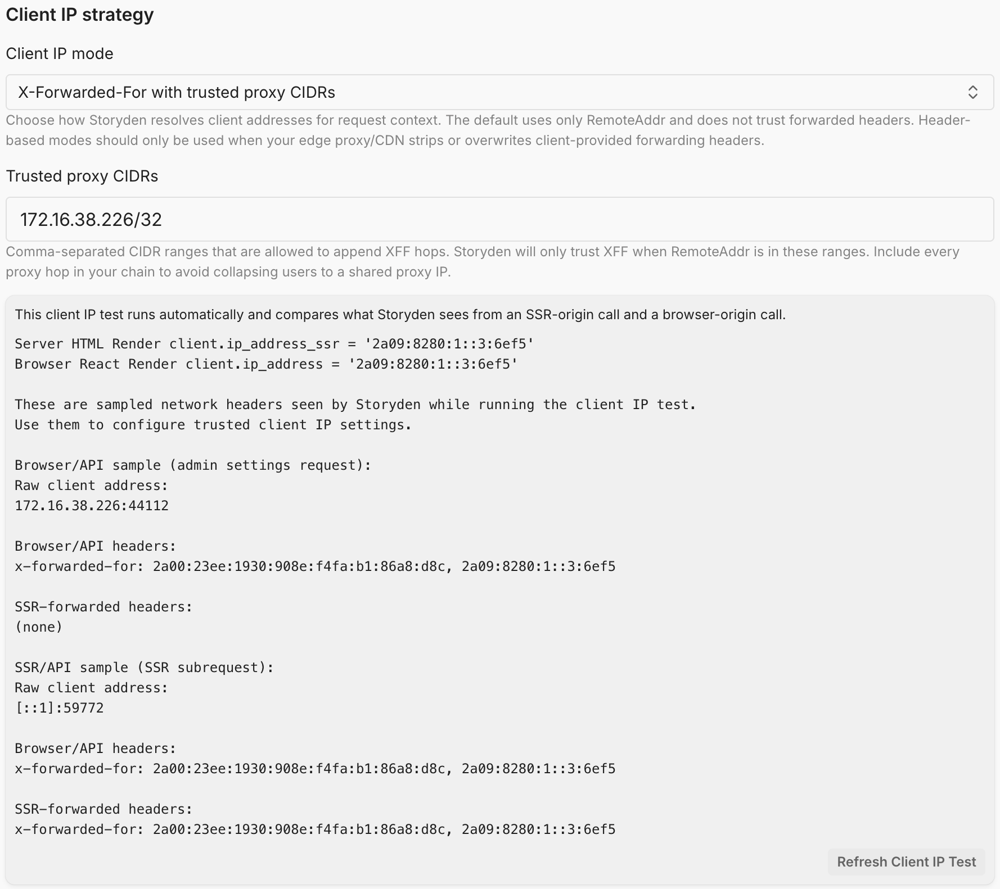
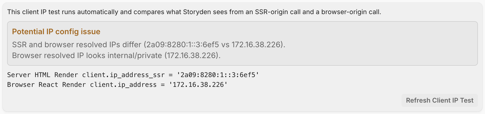

When you use the official Storyden Next.js frontend, server-side rendering (SSR) makes API requests from the frontend server, not directly from the browser.

Without SSR client-IP forwarding, the backend only sees the frontend server address for those requests, which can break:

- rate limiting (many users collapse into one IP key),
- IP-based moderation controls,
- diagnostics for proxy/header configuration.

To solve this, Storyden uses an SSR context forwarding flow:

1. The frontend marks SSR API requests with `X-Storyden-SSR: 1`.
2. The frontend forwards `X-Forwarded-For` unchanged.
3. The backend resolves client IP using the configured client-IP mode, exactly as it does for browser API calls.
4. The backend exposes `client.ip_address_ssr` on session info for SSR diagnostics.

## Fullstack Image

When you deploy the default Docker image, it bundles the backend and frontend into a single container.

The topology and network route path for a regular page load is:

`browser -> backend -> frontend SSR -> backend`

In this configuration, the backend is already the edge-facing trust boundary. SSR API requests are internal subrequests that carry the existing network header context.

The frontend does not derive a separate "SSR client IP" value. It forwards standard headers and the backend resolves IP using your selected mode.

## UI Settings vs Environment Variables

Client IP settings live in the Admin UI and are applied immediately:

- `client_ip_mode`: `remote_addr`, `single_header`, or `xff_trusted_proxies`
- `client_ip_header`: trusted header name for `single_header`
- `trusted_proxy_cidrs`: trusted proxy ranges for `xff_trusted_proxies`

You can use the diagnostic tools in the System settings screen to configure and validate your client IP mode.



There is currently no separate setup for SSR. If you run the frontend as a separate process perhaps for load balancing purposes, you will need to configure your reverse proxy to include `X-Forwarded-For`, the frontend will include this with requests to the API and apply the same logic to incoming requests.

For `xff_trusted_proxies` mode, SSR-origin API calls can also trust a separate "SSR source" peer address list:

- `SSR_TRUSTED_SOURCE_CIDRS` (env): comma/newline-separated CIDRs or IPs.
- `PROXY_FRONTEND_ADDRESS` (env): if host is `localhost` or a literal IP, Storyden auto-trusts it as an SSR source.

This is used only for SSR-marked requests (`X-Storyden-SSR: 1`) so bundled or externally hosted frontends can forward browser XFF chains without hard-coding loopback trust.

<Callout type="info">
  The `X-Storyden-SSR` header is not used as a source of trust, it's merely a
  marker used in combination with trusted proxy source CIDRs
  (`SSR_TRUSTED_SOURCE_CIDRS`) to apply the client IP logic. This prevents
  spoofing attacks.
</Callout>

## Reverse Proxy Guidance

When running behind proxies/CDNs:

- ensure your edge proxy strips/overwrites forwarded-IP headers from untrusted clients,
- configure Client IP mode in Admin settings to match your infrastructure,
- use the Admin header/IP test tools to validate browser-origin and SSR-origin behavior.

Misconfigured proxies can cause incorrect rate-limit keys and unreliable audit/abuse signals.

Storyden will warn you if it detects a mismatch or potential internal IP addresses in the client IP resolution process.



## Interpreting `ip_address_ssr`

- On SSR-origin API calls (`X-Storyden-SSR: 1`), `client.ip_address_ssr` is populated with the backend-resolved client IP for that SSR request.
- On browser-origin API calls, `client.ip_address_ssr` is always empty.

Comparing browser and SSR values helps diagnose proxy/header configuration issues.

In order for rate limiting to work effectively, these IPs must be the same. Otherwise, you may have a situation where the browser-origin request is rate-limited based on the correct client IP, but the SSR-origin request is rate-limited based on the frontend server IP, which would lead to rate limits being shared between all visitors, which will result in all visitors hitting `429` errors very quickly.

### `xff_trusted_proxies`

Use this mode when Storyden is behind one or more reverse proxies (e.g. Cloudflare, Nginx, Fly.io).

Storyden will use the `X-Forwarded-For` header to determine the client IP - but **only if the request actually came through a trusted proxy**.

#### How it works

1. Storyden checks the request's `RemoteAddr` (the immediate peer).
2. If that IP is **not in your trusted proxy CIDRs**, Storyden only continues for SSR-marked requests when `RemoteAddr` is in SSR trusted sources derived from `PROXY_FRONTEND_ADDRESS` and/or `SSR_TRUSTED_SOURCE_CIDRS`. Otherwise it is treated as direct and `RemoteAddr` is used.
3. If it _is_ trusted, Storyden reads the full `X-Forwarded-For` chain.
4. It walks the chain **from right to left**, skipping any IPs that are also trusted proxies or unparseable.
5. The first IP that is **not a trusted proxy** is selected as the client IP.
6. If all IPs in the chain are trusted proxies (or unparseable), it falls back to `RemoteAddr`.

For browser-origin requests, only `trusted_proxy_cidrs` is considered. SSR trusted sources are only used when `X-Storyden-SSR: 1` is present.

<Callout type="info">
  If you host the frontend elsewhere, and it happens to go through a proxy layer
  for SSR (server-to-server) requests, you must ensure that those proxy IP/CIDR
  ranges are included in `SSR_TRUSTED_SOURCE_CIDRS` and not
  `trusted_proxy_cidrs`.
</Callout>

#### Why this is safe

- Prevents attackers from spoofing `X-Forwarded-For`
- Only trusts headers added by infrastructure you control (or, at least, trust)
- Works with multiple proxy layers automatically

#### Example

```
RemoteAddr: 10.0.0.5
X-Forwarded-For: 1.2.3.4, 203.0.113.10
trusted_proxy_cidrs:
  - 10.0.0.0/8
  - 203.0.113.0/24
```

Resolution:

- `10.0.0.5` → trusted proxy ✅
- `203.0.113.10` → trusted proxy → skip
- `1.2.3.4` → not trusted → **selected as client IP**

#### When to use this

Use this mode if:

- You are behind a reverse proxy or CDN
- You control (or trust) the proxy layer
- You want accurate per-user rate limiting and logging

#### When _not_ to use this

- Your server is directly exposed to the internet → use `remote_addr`
- You don’t know your proxy IP ranges → use `single_header` instead, and select a header you know to be trusted (often a pitfall, be careful, [read this](https://adam-p.ca/blog/2022/03/x-forwarded-for/)).

#### Tips

- Always include **all proxy layers** in `trusted_proxy_cidrs`
- Prefer CIDR ranges over individual IPs
- Prefer trusted proxy CIDRs mode over `single_header` when possible
- If misconfigured, you may end up rate-limiting your proxy instead of users (and then, nobody will have a fun time)
